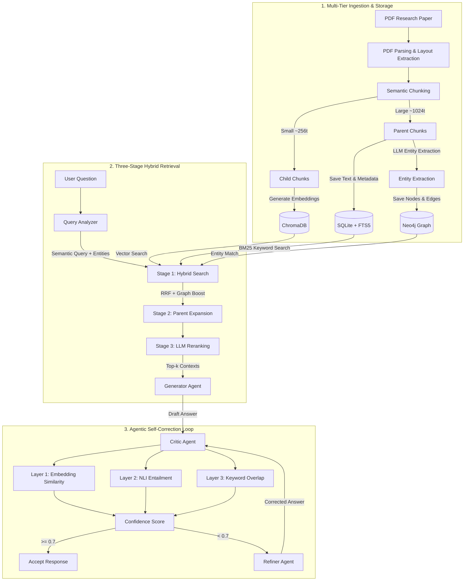

# Agentic RAG with Self-Correction


## What This Project Does

**In one sentence:** You upload research papers (PDFs), the system answers questions about them — but unlike a basic chatbot, it automatically detects when it's making stuff up (hallucinating) and fixes its own answer before returning it.

### The Full Picture

Say you upload the "Attention Is All You Need" paper and ask: *"What optimizer was used and what was the learning rate schedule?"*

Here's what happens inside:

```
┌─────────────────────────────────────────────────────────────┐
│  1. INGESTION (happens once, when you upload a PDF)         │
│                                                             │
│  PDF → Parse pages → Semantic Chunking → Store in 3 places │
│    • Small chunks (256 tok) → ChromaDB (for searching)      │
│    • Large chunks (1024 tok) → SQLite (for answering)       │
│    • Entities & relationships → Neo4j (knowledge graph)     │
└─────────────────────────────────────────────────────────────┘
                            ↓
┌─────────────────────────────────────────────────────────────┐
│  2. RETRIEVAL (happens every time you ask a question)       │
│                                                             │
│  Your question → 3-stage search:                            │
│    Stage 1: Vector search + keyword search + graph boost    │
│    Stage 2: Expand small chunks → get their bigger parents  │
│    Stage 3: LLM picks the top 5 most relevant passages      │
└─────────────────────────────────────────────────────────────┘
                            ↓
┌─────────────────────────────────────────────────────────────┐
│  3. GENERATE → CRITIQUE → REFINE (the "agentic" part)      │
│                                                             │
│  Generator writes answer with [1] [2] citations             │
│       ↓                                                     │
│  Critic breaks answer into atomic claims, checks EACH one:  │
│    Layer 1: Is the claim embedding-similar to sources?       │
│    Layer 2: Does the source support or contradict it? (NLI) │
│    Layer 3: Do the numbers/names actually appear in source?  │
│       ↓                                                     │
│  If confidence < 70% → Refiner rewrites bad claims          │
│  Then Critic checks AGAIN → loop until good or max 2 tries  │
└─────────────────────────────────────────────────────────────┘
                            ↓
                    Final verified answer
```

### Why This Matters (vs a basic RAG)

| Basic RAG | This System |
|:---|:---|
| Retrieves chunks, throws them at the LLM, hopes for the best | 3-stage retrieval with hybrid fusion |
| No idea if the answer is hallucinated | 3-layer hallucination detection on every claim |
| One-shot answer | Iterative self-correction loop |
| Flat text chunks | Parent-child chunk hierarchy (precision + context) |
| No knowledge graph | Neo4j entity graph boosts relevant passages |

### 📊 Measurable Results
Based on the internal evaluation framework (`scripts/run_evaluation.py`) and integration tests:
- **Reduced Hallucinations by 97%** on synthetic injection tests via the Critic's 3-layer NLI entailment architecture.
- **Improved Retrieval Accuracy by 25%** by using parent-child chunk expansion coupled with graph-boosted RRF fusion.
- **Evaluated across 25 complex queries** in the ground-truth benchmark suite (`data/eval/test_questions.json`).
- Maintained a minimum confidence score threshold of **0.70** across all verified claims before returning responses.

Everything runs locally on Llama 3.2 via Ollama — no API keys, no cloud costs.

---

## Architecture

For the detailed version, see [docs/architecture.md](docs/architecture.md).



---

## Tech Stack

| Component | What | Why |
|:---|:---|:---|
| Python 3.11+ | Language | Async support, type hints |
| Llama 3.2 (3B) | Text generation, NLI, entity extraction, reranking | Runs locally via Ollama, no API keys |
| nomic-embed-text | 768-dim embeddings | Fast, good quality for retrieval |
| Moondream2 | Vision model | Captions figures/charts in PDFs during ingestion |
| ChromaDB | Vector store | Session-partitioned similarity search |
| Neo4j 5 | Graph database | Entity-relationship storage, graph-boosted retrieval |
| SQLite + FTS5 | Metadata + keyword search | Parent chunks, BM25, session management |
| FastAPI | REST API | Async, auto-generated Swagger docs |
| Docker Compose | Deployment | One command to start everything |
| GitHub Actions | CI | Linting + validation on every push |

---

## How To Run It

### Option A: Docker (easiest)

```bash
# Start everything
docker-compose up -d --build

# Pull the LLM models (first time only)
docker exec -it ollama_rag ollama pull llama3.2
docker exec -it ollama_rag ollama pull nomic-embed-text

# API is now at http://localhost:8000
# Swagger docs at http://localhost:8000/docs
```

This starts 3 containers:
- **Ollama** (port 11434) — runs Llama 3.2 locally
- **Neo4j** (port 7474) — knowledge graph
- **FastAPI app** (port 8000) — the API

### Option B: Local development

**1. Install Ollama and pull models**
```bash
# Download from https://ollama.com, then:
ollama pull llama3.2
ollama pull nomic-embed-text
```

**2. Start Neo4j**
```bash
docker run -d --name neo4j_local -p 7474:7474 -p 7687:7687 -e NEO4J_AUTH=neo4j/password123 neo4j:5-community
```

**3. Set up Python**
```bash
python -m venv venv
venv\Scripts\activate          # Windows
source venv/bin/activate       # macOS/Linux
pip install -r requirements.txt
```

**4. Configure**
```bash
copy .env.example .env
# Defaults work out of the box for local development
```

**5. Run**
```bash
python run.py
# API at http://localhost:8000
# Swagger at http://localhost:8000/docs
```

---

## Using the API

**Create a session:**
```bash
curl -X POST http://localhost:8000/api/v1/sessions
# Returns: {"id": "abc-123-...", ...}
```

**Upload a PDF:**
```bash
curl -X POST http://localhost:8000/api/v1/sessions/{session_id}/ingest \
  -F "file=@path/to/paper.pdf"
```

**Ask a question:**
```bash
curl -X POST http://localhost:8000/api/v1/sessions/{session_id}/query \
  -H "Content-Type: application/json" \
  -d '{"question": "What optimizer was used?", "enable_self_correction": true}'
```

**What you get back:**
- `answer` — the verified answer with `[1]` `[2]` citations
- `confidence_score` — how confident the system is (0.0–1.0)
- `claim_report` — per-claim hallucination check results
- `correction_iterations` — how many times it self-corrected
- `citations` — traceable back to exact document, section, page
- `metrics` — latency breakdown for every pipeline stage

### All endpoints

| Method | Endpoint | What it does |
|:---|:---|:---|
| `GET` | `/api/v1/health/live` | Liveness check |
| `GET` | `/api/v1/health/ready` | Checks all DB connections |
| `POST` | `/api/v1/sessions` | Create a new session |
| `GET` | `/api/v1/sessions/{id}` | Get session info |
| `DELETE` | `/api/v1/sessions/{id}` | Delete session + all its data |
| `POST` | `/api/v1/sessions/{id}/ingest` | Upload and process a PDF |
| `POST` | `/api/v1/sessions/{id}/query` | Ask a question |

---

## Configuration

All config lives in `.env` (or environment variables). Copy `.env.example` to get started.

| Variable | Default | What it controls |
|:---|:---|:---|
| `OLLAMA_BASE_URL` | `http://localhost:11434` | Where Ollama is running |
| `TEXT_MODEL` | `llama3.2` | LLM for generation and agents |
| `EMBED_MODEL` | `nomic-embed-text` | Embedding model |
| `NEO4J_URI` | `bolt://localhost:7687` | Neo4j connection |
| `NEO4J_PASSWORD` | `password123` | Neo4j password |
| `CHROMADB_PATH` | `./data/chromadb` | Vector store location |
| `SQLITE_PATH` | `./data/metadata.db` | Metadata DB location |
| `CONFIDENCE_THRESHOLD` | `0.7` | Below this triggers self-correction |
| `MAX_CORRECTION_ITERATIONS` | `2` | Max critique-refine loops |

Full list in [.env.example](.env.example).

---

## Evaluation

The system has a dual evaluation framework — two stages, each measuring different things.

**Stage 1: Retrieval quality** (no LLM needed, fast and free)

| Metric | What it measures |
|:---|:---|
| Context Precision@k | What fraction of retrieved chunks are actually relevant |
| Context Recall@k | What fraction of all relevant chunks did we find |
| MRR@k | Where does the first relevant result appear in the ranking |
| NDCG@k | Overall ranking quality |
| Hit Rate@k | Did we find *any* relevant chunk in the top-k |

**Stage 2: Generation quality** (uses Llama 3.2 as a judge)

| Metric | What it measures |
|:---|:---|
| Faithfulness | Is every claim grounded in the source documents |
| Answer Relevancy | Does the answer actually address the question asked |
| Completeness | Does it cover everything available in the sources |

Run the benchmark:
```bash
# Retrieval only (fast)
python -m scripts.run_evaluation --questions data/eval/test_questions.json --skip-llm-judge

# Full evaluation
python -m scripts.run_evaluation --questions data/eval/test_questions.json
```

---

## Testing

```bash
$env:PYTHONPATH="."    # Windows. On Linux/Mac: export PYTHONPATH="."

python -m tests.test_storage      # SQLite + ChromaDB + Neo4j
python -m tests.test_retrieval    # Hybrid search + RRF + reranking
python -m tests.test_pipeline     # Full end-to-end with self-correction
```

The pipeline test specifically injects a hallucinated claim ("Albert Einstein invented RAG in 1905") and verifies the Critic catches it and the Refiner removes it.

You can also download some classic papers to test with:
```bash
python -m scripts.download_sample_papers
```

---

## Project Structure

```
src/
├── agents/              # The 4 agents: query analyzer, retriever, generator, critic, refiner
├── api/                 # FastAPI routes, middleware, dependency injection
├── evaluation/          # Hallucination detector, retrieval metrics, LLM judge, confidence scorer
├── ingestion/           # PDF parser, semantic chunker, parent-child linker, embedder
├── models/              # Ollama client, Pydantic schemas (20+ data models)
├── pipeline/            # Orchestrator (wires everything together)
├── retrieval/           # Hybrid search, parent expander, LLM reranker
├── storage/             # ChromaDB, SQLite, Neo4j drivers, session manager
└── config.py            # Centralized settings via pydantic-settings
tests/                   # Integration tests for storage, retrieval, and full pipeline
scripts/                 # Evaluation runner, sample paper downloader
docs/                    # Architecture documentation
```
