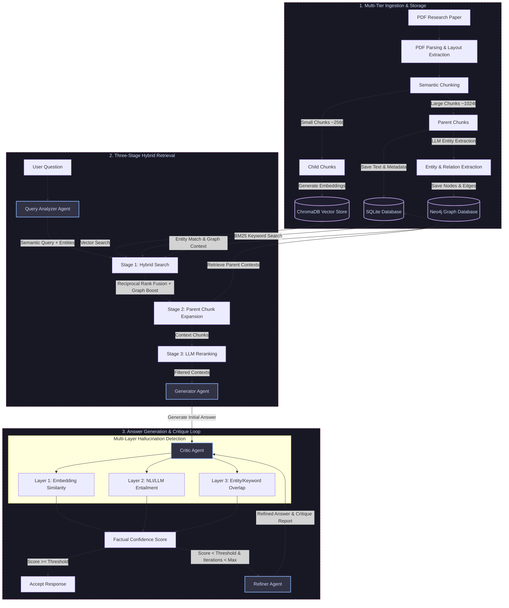

# System Architecture — Agentic RAG with Self-Correction

This document details the design and data flow of the **Agentic LLM System with Self-Correction**. The system is built to ingest research papers, process them into a hybrid storage system (SQL + Vector + Graph), perform multi-stage retrieval, and answer user queries with an agentic self-critique and correction loop.

---

## 1. High-Level Flow Diagram

The following diagram illustrates the complete lifecycle of a user query, from ingestion to retrieval and self-correction:

---

## 2. Storage System (Three-Tier Storage)

The system uses three distinct storage layers to balance fast similarity searching, rich relational context, and structured metadata:

1. **SQLite Database**:
   - Manages active user sessions, document metadata, and parent chunk texts.
   - Houses a Full-Text Search (FTS5) table for rapid BM25 keyword matching across document segments.
   - Restricts data lifecycle via cascading foreign keys linked to user sessions (deleting a session automatically purges related documents, chunks, and relationships).

2. **ChromaDB (Vector Store)**:
   - Houses dense embeddings of child chunks generated via Ollama's `nomic-embed-text` model.
   - Partitioned by `session_id` using ChromaDB's metadata filtering to enforce session isolation.

3. **Neo4j (Entity Graph Database)**:
   - Tracks semantic relationships (`USES`, `METHOD`, `METRIC`, etc.) extracted from documents.
   - Used for GraphRAG queries, exploring context paths, and boosting retrieval relevance for chunks that share entities with the user's question.

---

## 3. Retrieval Pipeline (Three-Stage)

To ensure the LLM receives the most factual, relevant context:

* **Stage 1: Hybrid Search (Vector + BM25 + Graph Boost)**:
  - Vector similarity search retrieves the top-k child chunks.
  - SQLite BM25 search retrieves key matches from parent chunks.
  - Reciprocal Rank Fusion (RRF) merges both rankings. Chunks whose entities match the Neo4j graph context receive a boost in the ranking.
* **Stage 2: Parent Chunk Expansion**:
  - The highest-ranked child chunks are resolved to their respective parent chunks (e.g. 1024 tokens) to supply structural context around the matched text.
* **Stage 3: LLM Reranking**:
  - A specialized Reranker model selects the top N most informative parent chunks, reducing noise and keeping context window usage highly efficient.

---

## 4. Agentic Self-Correction Loop

When a user submits a query:

1. **Query Analyzer Agent**:
   - Classifies query complexity (`SIMPLE`, `MODERATE`, or `COMPLEX`).
   - Reformulates queries semantically and extracts search keywords.
2. **Generator Agent**:
   - Assembles the prompt using the retrieved context chunks and formulates the response.
3. **Critic Agent**:
   - Performs granular claim extraction on the generated answer.
   - Validates each claim using **Three Hallucination Detection Layers**:
     - *Semantic Embedding layer*: Measures cosine similarity of claim embeddings against source context chunks.
     - *NLI Entailment layer*: Applies an LLM-as-a-Judge to classify if context supports/contradicts the claim.
     - *Keyword/Entity check*: Checks for hallucinated proper nouns and metrics.
   - Produces a **Factual Confidence Score** and a detailed report.
4. **Refiner Agent**:
   - If the score falls below the threshold (default: `0.7`), the Refiner consumes the critique report.
   - It rewrites only the hallucinated/unsupported segments of the response using the source context, keeping valid parts intact.
   - The response is re-submitted to the Critic, repeating the loop until it passes or hits `max_correction_iterations`.

---

## 5. Directory Mapping

The primary files implementing these systems include:

* **Config & Schemas**:
  * [src/config.py](../src/config.py) — Central application configuration.
  * [src/models/schemas.py](../src/models/schemas.py) — Shared Pydantic data models.
* **Storage Layer**:
  * [src/storage/document_store.py](../src/storage/document_store.py) — Metadata storage and SQLite configuration.
  * [src/storage/vector_store.py](../src/storage/vector_store.py) — ChromaDB partition management.
  * [src/storage/entity_graph.py](../src/storage/entity_graph.py) — Neo4j graph driver.
* **Agent System**:
  * [src/agents/query_analyzer.py](../src/agents/query_analyzer.py) — Query analyzer.
  * [src/agents/retriever.py](../src/agents/retriever.py) — Multi-stage retrieval.
  * [src/agents/generator.py](../src/agents/generator.py) — Answer generation.
  * [src/agents/critic.py](../src/agents/critic.py) — Hallucination evaluation.
  * [src/agents/refiner.py](../src/agents/refiner.py) — Answer refiner.
* **Orchestration**:
  * [src/pipeline/orchestrator.py](../src/pipeline/orchestrator.py) — Orchestrator combining retriever, generator, critic, and refiner.

